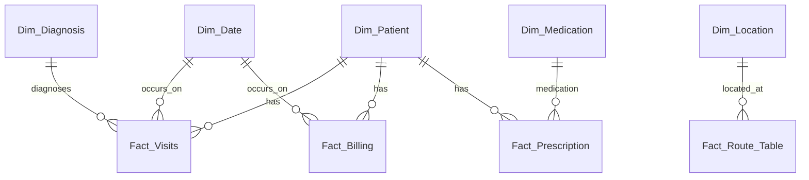

# Healthcare Data Warehouse Project

## 🚀 Overview
This project builds a complete Healthcare Data Warehouse (DWH) for a regional healthcare provider, integrating data from multiple source systems to support analytics such as patient care cost analysis, medication inventory tracking, and disease outbreak correlation.

## 📂 Project Structure
```
.
├── ETL_Script.py          # Python ETL pipeline
├── SQL_Schema.sql         # Data Warehouse schema creation
├── External_Public_Health_Data.csv # Public health data file
├── README.md              # Project documentation
```

## 📊 Data Sources
- Patient Records System (MySQL)
- Hospital Billing System (MySQL)
- Pharmacy Inventory System (MySQL)
- External Public Health Data (CSV)

## 📦 Features
- 👨‍💼 Data integration across different healthcare domains
- 🛋️ ETL pipeline with extraction, transformation, and loading
- 🔢 Dimensional modeling using Star Schema
- 📊 Analytical queries for treatment cost, stock levels, and disease outbreaks
- 🔄 Supports Slowly Changing Dimension (SCD) for patients
- 🚀 Scalability options for future expansion to more hospitals

## 🎓 Technologies Used
- Python (pandas, mysql-connector-python)
- MySQL (Databases, DWH)
- Mermaid.js (Schema diagrams)
- Git/GitHub (Version Control)

## 🔄 ETL Process
1. **Extract:** Connects to MySQL databases and reads CSV files.
2. **Transform:** Cleans and standardizes data (dates, missing values). Enriches billing data with diagnosis codes.
3. **Load:** Inserts records into the data warehouse tables using `cursor.execute()`.

## 🖊️ ER Diagram (Conceptual)


## 🔧 Setup Instructions
1. Clone this repository:
```bash
git clone https://github.com/yourusername/HealthcareDataWarehouse.git
```
2. Install Python requirements:
```bash
pip install pandas mysql-connector-python
```
3. Configure your database connections inside `ETL_Script.py`.
4. Create the warehouse schema by running the provided `SQL_Schema.sql`.
5. Run the ETL pipeline:
```bash
python ETL_Script.py
```

## 📊 Sample Analytics Queries
- Average Treatment Cost per Diagnosis and Age Group
- Medication Stock and Replenishment Alerts
- Correlation Between Disease Outbreaks and Hospital Visits

## 🚀 Future Improvements
- Automate ETL jobs using Apache Airflow or Cron jobs
- Add real-time streaming ingestion for the latest records
- Build visualization dashboards using Power BI or Tableau

## 📢 License
This project is licensed for educational and research purposes only.

> Built with ❤️ by Sher Muhammad
